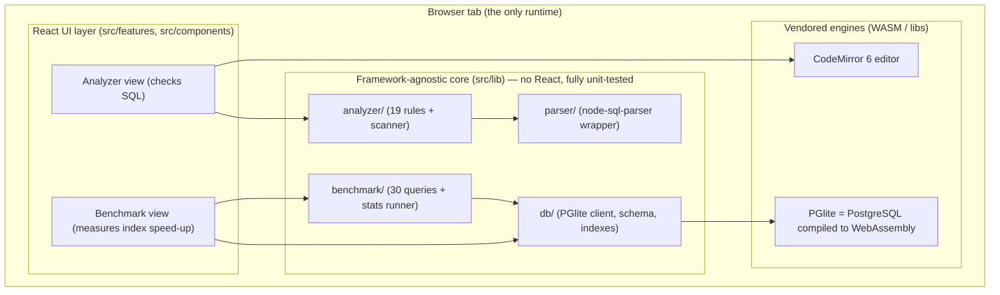

# SQL Query Doctor — Interview Preparation Guide

> A complete, interview-ready companion to the project. Read top-to-bottom once, then skim sections
> before an interview. Everything here reflects what is actually in the codebase — if you can
> explain this document, you can defend the project.

**What the project is, in one line:** a browser-based tool that (1) **checks** a SQL query for
performance anti-patterns and tells you how to fix them, and (2) **benchmarks** the real speed-up of
indexes on a 500K-row PostgreSQL running inside the browser — all with **no backend**.

---

## Table of contents

1. [The 30-second and 2-minute pitch](#1-the-30-second-and-2-minute-pitch)
2. [USP, differentiation & extra features (the "informal" stuff)](#2-usp-differentiation--extra-features)
3. [System design & architecture (with diagrams)](#3-system-design--architecture)
4. [Tech stack deep dive — what, why, why-not, key concepts, likely Q&A](#4-tech-stack-deep-dive)
   - [TypeScript](#41-typescript)
   - [React 18](#42-react-18)
   - [Vite](#43-vite)
   - [Vitest + Testing Library](#44-vitest--testing-library)
   - [PGlite + PostgreSQL + WebAssembly](#45-pglite--postgresql--webassembly)
   - [node-sql-parser](#46-node-sql-parser)
   - [CodeMirror 6](#47-codemirror-6)
   - [Supporting libraries (Fontsource, CSS tokens)](#48-supporting-libraries)
5. [The SQL domain — the heart of the project](#5-the-sql-domain)
   - [Sargability & indexes](#51-sargability--indexes-the-single-most-important-concept)
   - [The 19 anti-pattern rules](#52-the-19-anti-pattern-rules-with-examples)
   - [EXPLAIN, ANALYZE & the benchmark methodology](#53-explain-analyze--the-benchmark-methodology)
6. [File-by-file map — what each file does & how they link](#6-file-by-file-map)
7. [Rapid-fire interview Q&A](#7-rapid-fire-interview-qa)
8. [Known limitations & "what I'd do next" (senior signal)](#8-known-limitations--what-id-do-next)

---

## 1. The 30-second and 2-minute pitch

**30-second version:**
> "SQL Query Doctor is a browser-based SQL performance tool. It does two things: it lints SQL for
> performance anti-patterns across four dialects — each finding comes with *why it's slow* and *how
> to fix it* — and it runs a *real* PostgreSQL inside the browser via WebAssembly, so you can seed
> half a million rows and measure what indexes actually do. It's 100% client-side — no backend — and
> it has 120 tests."

**2-minute version — problem → solution → proof:**
- **Problem:** Developers write slow SQL and don't find out until production, and they rarely *prove*
  that a fix (like adding an index) actually helps — they guess.
- **Solution:** One tool that (a) catches the common mistakes statically, before you even run the
  query, and explains each one, and (b) lets you *measure* the fix on realistic data without
  installing or hosting anything.
- **Proof / the hard part:** Running a real database in the browser (PGlite compiles PostgreSQL to
  WebAssembly), a resilient linter that works even on SQL that doesn't fully parse, and a benchmark
  harness that produces honest, measured before/after numbers.

---

## 2. USP, differentiation & extra features

### What's the USP (unique selling proposition)?
1. **A real database in the browser, zero backend.** Most "SQL playgrounds" either hit a shared
   server or fake results with a tiny JS engine. This runs *actual PostgreSQL* (via PGlite / WASM) on
   a 500K-row dataset, entirely on the client. The benchmark numbers are **measured live**, not
   hard-coded.
2. **It proves the fix, not just suggests it.** The analyzer tells you *what* to change; the
   benchmark *measures* the payoff (add indexes → median query time drops). Suggestion + evidence.
3. **Explanations, not just flags.** Every lint finding ships with *why it's slow* and *how to fix
   it*, so it teaches, it doesn't just scold.

### How is it different from a typical student project?
- It's **not a CRUD app.** No "to-do list + REST API." The complexity is in *algorithms and data*
  (parsing heuristics, string/comment masking, a benchmark harness, real SQL semantics) — harder to
  fake, better to talk about.
- It's **genuinely tested** (120 tests), including a real-PGlite integration test, not just a couple
  of render tests.
- It has a **deliberate design system** (neo-brutalist frame + Solarized palette driven entirely by
  CSS custom properties).

### Extra features worth mentioning
- **Row-count & live progress** while seeding 500K rows in WASM.
- **Composite-index suggestions, keyset-pagination guidance, NULL-safety warnings** — details that
  signal you understand *production* SQL, not just syntax.
- **Privacy/offline by design**: no server means nothing you type leaves your machine; it even works
  offline after first load.

---

## 3. System design & architecture

### 3.1 The big picture

This is a **client-only Single Page Application (SPA)**. There is no server, no database host, no
API. Everything — including the PostgreSQL engine — runs in the user's browser tab.



### 3.2 The key architectural decision: `lib/` vs `features/`

The single most important design choice, and the one most worth explaining:

> **All the real logic lives in `src/lib/`, which has zero React imports. The React layer in
> `src/features/` is a thin "view" over it.**

**Why this matters (say this in an interview):**
- **Testability**: pure functions with no DOM/React can be unit-tested fast and deterministically.
  That's why there are 120 tests — the hard logic is trivially testable.
- **Separation of concerns**: the analyzer doesn't know it's in a browser; it could run in Node, a
  CLI, a CI hook, or a VS Code extension unchanged.
- **Replaceable UI**: I could swap React for Svelte and `src/lib` wouldn't change a line.

This is the classic **"functional core, imperative shell"** pattern (a.k.a. hexagonal / ports-and-
adapters). The `QueryExecutor` interface in `db/types.ts` is a literal *port*: the benchmark depends
on the interface, and either real PGlite (`db/client.ts`) or a mock in tests can be plugged in.

### 3.3 Data-flow per feature

**Analyzer:**
```
SQL text ─▶ buildContext() ─▶ { raw, masked, codeMask, ast }
                                    │
          run all 19 rules ◀────────┘   each rule.detect(ctx) → Detection[]
                │
          resolve positions + merge rule metadata + sort + dedupe
                │
          AnalysisResult { findings[], counts, parseError } ─▶ React cards
```

**Benchmark:**
```
"Initialize" ─▶ PGlite.create() (boot WASM Postgres) ─▶ seedDatabase() (generate_series, 500K rows)
"Run benchmark" ─▶ runBenchmark(db):
       drop indexes ─▶ time 30 queries (best of 3)   ← "before"
       create 8 indexes + ANALYZE
       time 30 queries again                          ← "after"
       ─▶ median before / median after / median speed-up ─▶ bars
```

### 3.4 System-design questions you might get

**Q: Why client-side only? What are the trade-offs?**
- **Pros:** zero infra cost, instant scaling (every user brings their own CPU), privacy (data never
  leaves the browser), works offline, trivial deployment (static files on a CDN).
- **Cons:** large first-load payload (the WASM Postgres is ~8 MB, ~3 MB gzipped), limited by the
  user's machine, single-threaded WASM so big workloads are slower than a server. For this tool those
  cons are acceptable — it's a developer utility, not a multi-tenant product.

**Q: How do you keep the initial load fast given the huge WASM payload?**
- **Code-splitting**: the Benchmark view (which pulls PGlite) is `React.lazy`-loaded, so the ~8 MB
  WASM only downloads when a user opens that tab — the Analyzer (the default/first page) never pays
  for it.
- **Manual vendor chunks** (`vite.config.ts` → `manualChunks`) split React, CodeMirror, and the SQL
  parser so they cache independently.
- Assets are content-hashed → immutable, long-lived CDN caching.

**Q: Security?**
- No backend means no server to attack and no secrets to leak. The user's SQL runs against *their
  own* in-browser database that only they can see. (I render user SQL as text, never as HTML, so
  there's no XSS surface either.)

**Q: How is state managed?**
- Deliberately simple: React local state (`useState`) + `useMemo` for derived data. No Redux/Zustand
  because there's no cross-cutting global state worth the complexity — each tab owns its state, and
  the one stateful resource (the PGlite instance) is held in a `useRef` inside a custom hook
  (`useDatabase`). **Knowing when *not* to add a state library is a senior signal.**

**Q: How would you scale this into a product?**
- Compute is already on the client, so it "scales" for free. For team features (saved queries,
  sharing) I'd add a thin *stateless* API + managed Postgres, and reuse the analyzer logic on the
  server — it's already framework-agnostic.

---

## 4. Tech stack deep dive

For each technology: **what it is → why I chose it → why not the alternative → key concepts
("branches") → likely questions.**

### 4.1 TypeScript

**What it is:** A superset of JavaScript that adds *static types*, checked at compile time and
erased at runtime (it compiles to plain JS). It catches type errors before the code runs.

**Why I chose it:** The project is data-heavy — AST shapes, finding objects, benchmark results. Types
act as live documentation and caught dozens of mistakes during development. For a rules engine with a
shared `Rule`/`Finding` contract, types are the difference between "it compiles" and "a rule silently
returns the wrong shape."

**Why not plain JavaScript:** No compile-time safety; refactors become dangerous; the
`Rule`/`Finding`/`QueryExecutor` contracts would only live in my head.

**Key concepts / branches to know:**
- **Types vs interfaces** — `interface` for object shapes (`Rule`, `Finding`), `type` for unions
  (`type Dialect = "postgresql" | "mysql" | ...`).
- **Union & literal types** — `Severity`, `Category`, `Dialect` are string-literal unions; they make
  illegal states unrepresentable.
- **Generics** — e.g. the `QueryExecutor` result types, `percentile(values: number[])` helpers.
- **`strict` mode** — `tsconfig` has `strict`, `noUnusedLocals`, `noUnusedParameters`,
  `noFallthroughCasesInSwitch`.
- **Structural typing** — the `QueryExecutor` *mock* in tests satisfies the interface by shape, no
  `implements` needed.
- **`satisfies` operator** — used in `analyze.ts` to type-check a value without widening it.
- **Type erasure** — types vanish at runtime; you can't `instanceof` an interface.
- **`unknown` vs `any`** — the parser wrapper takes `unknown` AST and narrows it safely.

**Likely questions:**
- *`interface` vs `type`?* Interfaces are open/mergeable, great for objects; `type` also does unions,
  tuples, mapped/conditional types.
- *`strictNullChecks`?* `null`/`undefined` aren't assignable unless declared — forces explicit
  handling.
- *Does TS make code faster at runtime?* No — it's erased; it improves developer speed/correctness.
- *`any` vs `unknown`?* `any` disables checking; `unknown` must be narrowed before use.

### 4.2 React 18

**What it is:** A declarative UI library. UI is a function of state (`UI = f(state)`); React diffs a
virtual DOM and updates only what changed.

**Why I chose it:** The UI is interactive and state-driven (live linting as you type, expandable
cards, tab switching, an async DB lifecycle with progress). React's hooks fit that, and the ecosystem
(the CodeMirror React wrapper) is mature.

**Why not vanilla JS/jQuery:** Manual DOM updates for live-updating findings would be error-prone.
**Why not Angular:** heavier, overkill for a 2-view app. **Why not Svelte/Vue:** fine, but React has
the deepest ecosystem and is the most common interview expectation; the core `lib/` is
framework-agnostic anyway.

**Key concepts / branches (hooks I actually use):**
- **`useState`** — local state (current SQL, dialect, dataset size, benchmark report).
- **`useMemo`** — memoizes derived data: `const result = useMemo(() => analyzeSql(sql, dialect),
  [sql, dialect])` re-lints only when the input changes.
- **`useRef`** — holds the PGlite instance across renders *without* triggering re-renders.
- **`useCallback`** — stable function identities in the `useDatabase` hook.
- **`React.lazy` + `Suspense`** — code-split the Benchmark view so PGlite loads on demand.
- **`StrictMode`** — dev-only double-invocation to surface impure effects.
- **Controlled components** — the editor/selects are controlled (value + onChange).
- **Lists & `key`** — findings/benchmark rows rendered from arrays with stable keys.
- **Custom hooks** — `useDatabase()` encapsulates the whole PGlite lifecycle behind a clean API.

**Likely questions:**
- *Virtual DOM / reconciliation?* An in-memory tree React diffs to compute minimal real-DOM updates.
- *Why `key`s?* Stable identity across renders; avoid array indices for reorderable lists.
- *`useMemo` vs `useCallback`?* Memoize a *value* vs a *function* (`useCallback(fn) = useMemo(() =>
  fn)`).
- *Why `useRef` for the DB, not `useState`?* Mutating a ref doesn't re-render; the DB is a resource
  handle, not UI state.

### 4.3 Vite

**What it is:** A modern build tool + dev server. Dev serves source over native ES modules with
instant HMR; production bundles with Rollup.

**Why I chose it:** Near-instant dev startup/HMR, first-class TS/React, easy WASM handling, and simple
config for the two things this project needs — excluding PGlite from pre-bundling and splitting
vendor chunks.

**Why not Create React App:** deprecated, slow (Webpack). **Why not raw Webpack:** far more config.
**Why not Parcel:** fine, but Vite is the current standard with better WASM/ESM ergonomics.

**Key concepts / branches:**
- **Dev vs build**: dev uses **esbuild** (Go, very fast) + native ESM; build uses **Rollup**
  (tree-shaken, code-split, minified).
- **HMR (Hot Module Replacement)**: swaps changed modules without a full reload. (Gotcha I hit and
  documented: HMR can remount a view mid-benchmark — don't edit source while one runs.)
- **`optimizeDeps.exclude: ['@electric-sql/pglite']`**: PGlite ships `.wasm`/`.data` assets that must
  *not* be pre-bundled or the asset URLs break.
- **`manualChunks`**: splits `vendor-react`, `vendor-editor`, `vendor-sqlparser` so app-code changes
  don't bust big vendor caches.
- **Content hashing**: output filenames include a hash → safe long-term caching.
- **Tree-shaking**: unused exports dropped.

**Likely questions:**
- *Why is Vite's dev server fast?* Native ESM (no bundling in dev) + esbuild transforms.
- *Dev vs prod difference?* Dev = unbundled ESM; prod = Rollup bundle, minified, split, hashed.
- *What is code-splitting and why?* Load chunks on demand → smaller initial download.

### 4.4 Vitest + Testing Library

**What it is:** Vitest is a Vite-native test runner (Jest-compatible API). Testing Library renders
components and queries them as a user would. **jsdom** provides a fake DOM in Node.

**Why I chose it:** It reuses my Vite config (same aliases/transforms) so tests "just work," and it's
fast. The API mirrors Jest, so the knowledge transfers.

**Why not Jest:** needs separate Babel/TS config, slower start, doesn't share Vite's resolution.

**Key concepts / branches:**
- **Unit vs integration**: most tests are pure unit tests on `src/lib`; `db/__tests__/
  integration.test.ts` is a real integration test — it boots actual PGlite and exercises seeding,
  indexing, and every benchmark query on a *small* dataset.
- **Test doubles / mocks**: `benchmark/__tests__/runner.test.ts` uses a `MockExecutor` implementing
  the `QueryExecutor` interface, so I can test the benchmark *orchestration* (drop → measure → index →
  measure) deterministically, without a real DB. This is the payoff of the port/adapter design.
- **Arrange–Act–Assert** structure.
- **Positive & negative cases**: every lint rule has a test that it *fires* on bad SQL and *doesn't*
  fire on good SQL — crucial for a linter (false positives are as bad as misses).
- **Coverage**: `npm run coverage` (v8 provider) over `src/lib`.

**Likely questions:**
- *Unit vs integration?* One function in isolation vs multiple pieces together (here, real PGlite +
  schema + queries).
- *Why mock the DB in some tests but use the real one in others?* Mock → fast, deterministic logic
  tests; real → confidence the actual SQL/DDL is valid. Both have their place.
- *What makes a good linter test?* Both a true-positive and a true-negative per rule, plus edge cases
  (a keyword inside a string/comment must *not* trigger).

### 4.5 PGlite + PostgreSQL + WebAssembly

**This is the showpiece — know it cold.**

**What it is:** **PGlite** (`@electric-sql/pglite`) is PostgreSQL compiled to **WebAssembly (WASM)**,
packaged as a library. It's a *complete* Postgres (the real query planner, executor, types,
`generate_series`, `EXPLAIN ANALYZE`) running inside the browser's JS engine — no server, no network.

**What is WebAssembly?** A portable binary instruction format that runs in the browser at
near-native speed, letting languages like C/C++/Rust run on the web. Postgres is C, so it can be
compiled to WASM and executed by the browser's WASM runtime.

**Why I chose it:** It's the only way to make the benchmark *honest* — real Postgres means the cost
model and the planner are genuine, so "add an index → median drops" is a true measurement, not a
simulation. And it needs **no backend**.

**Why not a hosted Postgres / a backend:** cost, infra, latency, and it would turn a self-contained
tool into "a web app talking to a DB." **Why not sql.js (SQLite in WASM):** I specifically wanted
Postgres's planner/statistics so index effects are realistic. **Why not an in-JS fake:** it would
defeat the entire "real measurement" USP.

**Key concepts / branches:**
- **`generate_series(1, N)`** — a set-returning function used to seed 500K rows in one
  `INSERT ... SELECT` without a client-side loop (see `db/schema.ts`).
- **`ANALYZE` (the statistics command)** — refreshes the planner's table statistics. I run it after
  seeding and after creating indexes so the planner makes good decisions. (Stale stats are a common
  real-world cause of bad plans.)
- **`EXPLAIN` vs `EXPLAIN ANALYZE`** — `EXPLAIN` shows the *estimated* plan; `ANALYZE` actually runs
  the query and reports *actual* rows/time. (Good to know conceptually even though the UI focuses on
  wall-clock timing.)
- **Single-threaded WASM** — PGlite runs on one thread; that's why big scans are slower than a server
  and why the benchmark is a *relative* before/after measurement, not an absolute benchmark.
- **The `QueryExecutor` port** — `db/client.ts` wraps PGlite behind my interface so the rest of the
  app (and tests) don't depend on PGlite directly.

**Likely questions:**
- *Is this really Postgres?* Yes — the actual Postgres C codebase compiled to WASM, not a rewrite.
- *Where does the data live?* In the browser's memory (PGlite can also persist to IndexedDB; here
  it's in-memory per session).
- *Why slower than a normal Postgres?* Single-threaded, in a browser sandbox, no OS-level I/O
  parallelism. The *ratios* (index speed-ups) still hold.
- *What is WASM and why not just JS?* A compiled binary format that's faster and lets existing C/C++
  (like Postgres) run in the browser; you couldn't realistically rewrite Postgres in JS.

### 4.6 node-sql-parser

**What it is:** A JavaScript SQL parser that turns SQL text into an **AST (Abstract Syntax Tree)** and
supports multiple dialects (PostgreSQL, MySQL, T-SQL/`transactsql`, SQLite, etc.).

**Why I chose it:** The most mature multi-dialect SQL parser in JS, and its dialect support maps
directly onto my "4 dialects" requirement.

**Why not write my own parser:** SQL grammar is huge; hand-rolling one would be months and still
incomplete. **Why not regex alone:** regex can't understand nested structure reliably.

**Key concepts / branches:**
- **AST (Abstract Syntax Tree)** — a tree representation of code structure (SELECT with columns,
  FROM, WHERE sub-trees). A classic interview topic.
- **Lexer/parser basics** — tokenize text, then build a tree per a grammar.
- **Hybrid approach (important nuance)** — I *don't* rely solely on the AST. Parsers fail on edge
  cases, so my linter is **text-driven with AST as a bonus**: it still lints SQL that doesn't fully
  parse. `parser/parse.ts` captures the error instead of throwing. This is a deliberate robustness
  decision.

**Likely questions:**
- *What's an AST?* A structured tree of parsed code; compilers/linters/formatters use them.
- *Why not use the AST for every rule?* Parsers break on real-world SQL; a text-first scanner with
  string/comment masking is more robust for a linter. (A great "I made a trade-off" answer.)

### 4.7 CodeMirror 6

**What it is:** A modern, extensible code-editor component (syntax highlighting, selection, line
numbers). I use `@uiw/react-codemirror` (React wrapper) + `@codemirror/lang-sql`.

**Why I chose it:** Lighter and more modular than Monaco (the VS Code editor), with first-class SQL
language support that's *dialect-aware*, and easy to theme to the design system.

**Why not Monaco:** huge (basically VS Code) — overkill for a single SQL input. **Why not a plain
`<textarea>`:** no syntax highlighting or SQL awareness.

**Key concepts / branches:**
- **Extensions architecture**: CM6 is composed of extensions (language, theme, line numbers). I pass
  `sql({ dialect })`, a custom theme, and `EditorView.lineWrapping`.
- **Dialect mapping**: my `Dialect` union maps to CodeMirror's SQL dialects
  (`PostgreSQL/MySQL/MSSQL/SQLite`) in `editorTheme.ts`.
- **Theming**: `EditorView.theme()` for chrome + a `HighlightStyle` mapping Lezer syntax *tags*
  (keyword/string/number/comment) to Solarized colors.
- **Lezer**: CodeMirror's incremental parser; `@lezer/highlight` provides the tags I style.
- **Controlled component**: value + `onChange` wired to React state so edits re-trigger linting.

**Likely questions:**
- *Why CodeMirror over Monaco?* Smaller, modular, enough features; Monaco is overkill.
- *How does syntax highlighting work?* The language parser (Lezer) tags tokens; a highlight style
  maps tags to colors.

### 4.8 Supporting libraries

- **Fontsource** (`@fontsource/*`) — self-hosts the fonts (Anton, Space Grotesk, JetBrains Mono) as
  npm packages so the app works **offline** and doesn't depend on Google Fonts' CDN (privacy +
  reliability).
- **CSS custom properties (design tokens)** — the entire theme is variables in
  `src/styles/tokens.css`. Switching from the original hot-pink "Yestalgia" look to **Solarized** was
  mostly editing *one file*. A design-system / maintainability decision, not just styling.

---

## 5. The SQL domain

This is the core knowledge the whole project is built on. If the interviewer is technical, this is
where you win or lose.

### 5.1 Sargability & indexes (the single most important concept)

**Index (B-tree):** Most databases index columns with a **B-tree** — a balanced, sorted tree giving
O(log n) lookups and efficient *range* scans. The index stores column values in sorted order plus
pointers to the rows.

**Sargable** = "**S**earch **ARG**ument **able**" = a `WHERE` condition the database can satisfy by
seeking/ranging an index instead of scanning every row. **Non-sargable** conditions force a
**full/sequential scan** (read every row), which is O(n).

The analyzer is, at heart, a **sargability checker**. The golden rule it enforces:

> **Keep the indexed column "bare" on one side of the comparison.** The moment you wrap it in a
> function, add a leading wildcard, or change its type, the B-tree (sorted by the *raw* value) can't
> be used.

Examples (bad → good):
| Non-sargable (full scan) | Sargable (index usable) |
| --- | --- |
| `WHERE YEAR(created_at) = 2024` | `WHERE created_at >= '2024-01-01' AND created_at < '2025-01-01'` |
| `WHERE name LIKE '%smith'` | `WHERE name LIKE 'smith%'` (or a trigram index for contains) |
| `WHERE user_id = '42'` (string vs int) | `WHERE user_id = 42` |
| `WHERE UPPER(email) = 'A@B.COM'` | store/compare lowercase, or a functional index |

**Index types to know:**
- **B-tree** — default; equality + range + sorting + prefix.
- **Composite (multi-column)** — e.g. `(user_id, status)`; follows the **leftmost-prefix rule** (can
  use it for `user_id` alone or `user_id + status`, but not `status` alone).
- **Covering / index-only scan** — if the index contains *all* columns the query needs, the DB never
  touches the table. (This is why `SELECT *` is flagged — it defeats covering indexes.)
- **Unique index** — enforces uniqueness + speeds equality lookups (I use one on `users.email`).
- **GIN / trigram (pg_trgm)** — the real fix for leading-wildcard / `%contains%` search.

### 5.2 The 19 anti-pattern rules (with examples)

Grouped by category (`src/lib/analyzer/rules/`). Each rule carries a severity, an explanation, and a
fix.

**Index usage (`indexUsage.ts`)**
1. **leading-wildcard-like** (high) — `LIKE '%foo'` can't use a B-tree (sorted by prefix). Fix:
   anchor (`'foo%'`) or a trigram/full-text index.
2. **non-sargable-function** (high) — `UPPER(col) = …`, `DATE(col) = …` wrap the column. Fix: bare
   column + range, or a functional index.
3. **implicit-conversion** (medium) — `user_id = '42'` compares int to string → implicit cast may
   disable the index. Fix: match the literal's type.
4. **or-in-where** (medium) — `OR` across columns often prevents a single index range. Fix: `IN`,
   `UNION ALL`, or a composite/partial index.
5. **inequality-operator** (low) — `!=` / `<>` is non-sargable (matches almost everything).
6. **like-no-wildcard** (low) — `LIKE 'x'` with no wildcard is just `=`; use `=`.
7. **having-without-aggregate** (low) — filtering a plain column in `HAVING` runs *after* grouping;
   move it to `WHERE` so it filters first (and can use an index).

**Joins / subqueries (`joins.ts`)**
8. **not-in-subquery** (high) — `NOT IN (SELECT …)` is slow *and* returns zero rows if the subquery
   yields a `NULL` (3-valued-logic trap). Fix: `NOT EXISTS` / anti-join.
9. **in-subquery** (medium) — `IN (SELECT …)` can materialize the inner result; prefer `EXISTS`/JOIN.
10. **scalar-subquery-in-select** (medium) — a subquery per output column is the SQL equivalent of
    **N+1** (runs once per row). Fix: fold into a JOIN.
11. **implicit-cross-join** (high) — `FROM a, b` without a join condition = Cartesian product. Fix:
    explicit `JOIN … ON`.

**Projection (`projection.ts`)**
12. **select-star** (medium) — `SELECT *` inflates I/O and defeats covering indexes. Fix: list columns.
13. **select-distinct** (low) — `DISTINCT` often masks a join that fans out rows; it forces a
    sort/hash to dedupe.

**Sorting (`sorting.ts`)**
14. **order-by-random** (high) — `ORDER BY random()` sorts the *whole* table to pick a few rows. Fix:
    `TABLESAMPLE` or key-based random selection.
15. **limit-without-order-by** (low) — `LIMIT` with no `ORDER BY` returns a non-deterministic subset.

**Pagination (`pagination.ts`)**
16. **large-offset-pagination** (medium) — `OFFSET 100000` still reads and discards 100K rows every
    call → deep pages get linearly slower. Fix: **keyset/seek pagination**
    (`WHERE id > :lastId ORDER BY id LIMIT n`).

**Set operations (`setOps.ts`)**
17. **union-instead-of-union-all** (medium) — `UNION` deduplicates (sort/hash); use `UNION ALL` when
    duplicates can't occur.

**Correctness (`correctness.ts`)**
18. **missing-where-dml** (critical) — `UPDATE`/`DELETE` with no `WHERE` hits every row.
19. **equals-null** (medium) — `= NULL` is always UNKNOWN (3-valued logic); use `IS NULL`.

**The clever implementation detail to mention:** rules scan a **masked** copy of the SQL where the
*contents* of string literals and comments are blanked out (but length preserved, so positions stay
exact). That's why `WHERE name = 'DELETE FROM x'` doesn't trigger the DELETE rule — the keyword is
inside a string. See `context.ts` (`maskSql`) and `scan.ts`.

### 5.3 EXPLAIN, ANALYZE & the benchmark methodology

**`EXPLAIN`** asks the database to show the query execution plan (scans, joins, sorts) with estimated
cost/rows; **`EXPLAIN ANALYZE`** actually runs it and adds actual rows/time. **`ANALYZE`** (a separate
command) refreshes the planner's statistics — I run it after seeding and after indexing so the
planner chooses good plans.

**The benchmark (`src/lib/benchmark/runner.ts`) — goal:** prove, with measured numbers, that the
suggested indexes help.

**Method:**
1. **Drop** all suggested indexes → the "before" baseline (forces sequential scans).
2. Run each of the **30 queries** (`benchmark/queries.ts`), timing each; repeat 3× and keep the
   **best (min)** time per query (minimizes noise from GC/JIT).
3. **Create** the 8 suggested indexes (`db/indexes.ts`) + `ANALYZE`.
4. Run the 30 queries again → the "after" time.
5. Report **median before**, **median after**, and **median speed-up** per query and overall.

**Why median, not mean?** Median is robust to outliers (one GC pause won't skew it); means get
dragged by tails. There's also a `percentile()` helper for p95-style stats.

**Why "best of 3" per query?** The *minimum* is the cleanest estimate of true cost — background noise
can only make a run *slower*, never faster, so the fastest run is closest to the real work.

**What the numbers show:** point-lookups (e.g. "orders for one user") go from a full scan of 500K
rows to an index seek — often **50–100×+** faster. Some *aggregate* queries (e.g. "revenue by
category" over all rows) barely change, because they must read everything regardless — **and I kept
those in on purpose**: an honest benchmark with mixed results is more credible than an all-wins chart.

**Honesty note for a résumé line like "1.2 s → 25 ms":** the app measures *live*, so exact numbers
depend on the machine and dataset size. On a 100K run I measured ~25 ms → ~1.2 ms median (≈7× median,
100×+ on point lookups); on 500K the "before" times are larger. The *method* is what matters and is
fully reproducible.

**Analogy to other stacks:** this is the same idea as benchmarking any code — establish a baseline,
change one variable (add indexes), re-measure, report the delta with a robust statistic. It's A/B
testing for database performance.

---

## 6. File-by-file map

### Config & root
| File | Purpose |
| --- | --- |
| `package.json` | Dependencies + scripts (`dev`, `build`, `test`, `typecheck`, `coverage`). |
| `vite.config.ts` | Build config: React plugin, `@` path alias, **PGlite excluded** from pre-bundle, **manualChunks** vendor splitting. |
| `vitest.config.ts` | Test config: jsdom env, globals, setup file, coverage of `src/lib`. |
| `tsconfig*.json` | TypeScript config (app vs node) in strict mode. |
| `index.html` | SPA entry; loads `src/main.tsx`. |
| `README.md` / `CLAUDE.md` | Project overview / contributor guide. |

### Entry & shell
| File | Purpose |
| --- | --- |
| `src/main.tsx` | React root; imports fonts + all CSS; renders `<App>`. |
| `src/App.tsx` | App shell: header, two-tab nav, **lazy-loads** the Benchmark view, footer, decorations. |
| `src/vite-env.d.ts` | Ambient types for Vite (CSS/asset imports). |

### Styles (design system)
| File | Purpose |
| --- | --- |
| `src/styles/tokens.css` | **All color/spacing/typography tokens** (Solarized palette) as CSS variables. |
| `src/styles/global.css` | Base/reset, body canvas + grid, shared primitives. |
| `src/styles/components.css` | Buttons, pills, badges, selects, segmented control. |
| `src/styles/app.css` | Layout: header, main grid, cards, metrics, footer. |
| `src/styles/features.css` | Finding cards, benchmark bars, progress, grids. |

### UI components
| File | Purpose |
| --- | --- |
| `src/components/ui/primitives.tsx` | Reusable `Button`, `Badge`, `Card`, `Select`, `Segmented`. |
| `src/components/Decor.tsx` | Decorative SVG Memphis shapes (bolt, star, blob). |

### Core logic — `src/lib/` (no React; this is where the tests are)

**analyzer/** (the linter)
| File | Purpose |
| --- | --- |
| `types.ts` | `Dialect`, `Severity`, `Category`, `Finding`, `Rule`, `SqlContext` contracts. |
| `context.ts` | `buildContext()` + **`maskSql()`** (blank strings/comments) + position math. |
| `scan.ts` | Scanning helpers: regex over masked text, WHERE/ON clause detection. |
| `rules/*.ts` | The 19 rules, grouped by category. |
| `rules/index.ts` | `ALL_RULES` registry + `RULES_BY_ID`. |
| `analyze.ts` | `analyzeSql()` — runs rules, resolves positions, sorts, dedupes, counts. |

**parser/**
| File | Purpose |
| --- | --- |
| `parse.ts` | Wraps `node-sql-parser`; returns AST **or a captured error** (never throws). |

**db/** (PGlite + dataset)
| File | Purpose |
| --- | --- |
| `types.ts` | `QueryExecutor` **port** interface + result types. |
| `schema.ts` | DDL + `seedDatabase()` via `generate_series` (users/products/orders). |
| `indexes.ts` | The 8 `SUGGESTED_INDEXES` + create/drop helpers. |
| `client.ts` | `PgliteExecutor` — real PGlite adapter; `run`, `exec`, `rowCount`. |

**benchmark/**
| File | Purpose |
| --- | --- |
| `queries.ts` | The 30 benchmark queries (grouped by access pattern). |
| `runner.ts` | Pure stats (`median`, `percentile`) + `runBenchmark()` orchestration. |

### Feature views — `src/features/`
| File | Purpose |
| --- | --- |
| `analyzer/AnalyzerView.tsx` | Editor + dialect picker + live findings + rule catalog. |
| `analyzer/SqlEditor.tsx` | CodeMirror wrapper (dialect-aware, themed). |
| `analyzer/editorTheme.ts` | Solarized CodeMirror theme + dialect mapping. |
| `analyzer/FindingCard.tsx` | Expandable finding (why / how-to-fix). |
| `analyzer/examples.ts` | Demo SQL snippets. |
| `benchmark/BenchmarkView.tsx` | Boot/seed UI (PGlite lifecycle) + row-count metrics. |
| `benchmark/useDatabase.ts` | Custom hook: PGlite lifecycle (status/progress/init). |
| `benchmark/BenchmarkPanel.tsx` | Runs the benchmark, renders before/after bars. |

### How they link (one sentence)
`main.tsx` → `App.tsx` mounts one of two **views** (`features/`), each of which calls into the
framework-agnostic **core** (`lib/`); the Analyzer uses `analyzer/` + `parser/`, and the Benchmark
uses `db/` (PGlite) + `benchmark/`.

---

## 7. Rapid-fire interview Q&A

**"Walk me through the project."** → Use the 2-minute pitch (§1), then offer to deep-dive either tool.

**"What was the hardest part?"** → Making the linter robust to SQL that doesn't fully parse — the
string/comment **masking** trick (scan structure on a masked copy, read literals from the raw text),
and getting an *honest* benchmark out of a single-threaded WASM Postgres (best-of-3, medians).

**"What's a bug you hit?"** → My regex rules initially scanned the *masked* text but then tried to
read a string literal (which masking had blanked), so leading-wildcard `LIKE` never fired — I fixed it
by locating the keyword on masked text but reading the literal from the raw text.

**"Why no backend?"** → It's a developer tool; client-side gives zero infra, privacy, offline use,
and — crucially — PGlite makes a real database available without one. (§3.4)

**"How do you test something with a database?"** → Two layers: a `MockExecutor` for fast deterministic
logic tests, and a real-PGlite integration test on a small dataset for confidence the SQL is valid.

**"How would you add a new lint rule?"** → Implement a `Rule` with a `detect(ctx)` returning
`Detection[]`, register it in `rules/index.ts`, add a positive + negative test. The architecture is
built for this.

**"Is it hard / did you really build it?"** → It's breadth over raw difficulty: the engines (Postgres,
CodeMirror) are mature libraries I integrated; the custom work (heuristic linter, benchmark harness)
is algorithmic and fully explained above. Everything is real and measured.

**Core CS one-liners** (be ready):
- *Time complexity of an index lookup?* O(log n) for a B-tree. *Full scan?* O(n).
- *Why is `LIKE '%x'` slow but `'x%'` fast?* B-trees are sorted by prefix; a leading wildcard has no
  prefix to seek.
- *Cartesian product size?* rows(a) × rows(b).
- *3-valued logic?* SQL booleans are TRUE/FALSE/**UNKNOWN**; comparisons with `NULL` yield UNKNOWN.

---

## 8. Known limitations & "what I'd do next"

Mentioning these *unprompted* is a strong senior signal — it shows judgment, not insecurity.

- **The linter is heuristic, not a full semantic analyzer.** It uses text scanning + a best-effort
  AST, so it can have occasional false positives/negatives (e.g. it doesn't know which columns are
  actually indexed). A deeper version would read the real schema. *Trade-off: robustness over
  precision.*
- **PGlite is single-threaded**, so absolute timings aren't server-grade; the benchmark is a
  *relative* before/after measurement (which is what matters).
- **First-load payload is large** (~3 MB gzipped for the WASM Postgres). Mitigated by lazy-loading
  the Benchmark tab.
- **The benchmark runs a fixed query suite**, not the user's own pasted query. A natural next step is
  to benchmark the *analyzed* query directly (run it, apply the suggested index, re-run, show the
  delta) — tying the two tools together.
- **No persistence**: the in-browser DB resets on refresh. PGlite supports IndexedDB persistence,
  which I'd add next along with saved queries.

---

*This document mirrors the codebase as built. If an interviewer opens the repo, every claim here is
backed by a file you can point to.*
