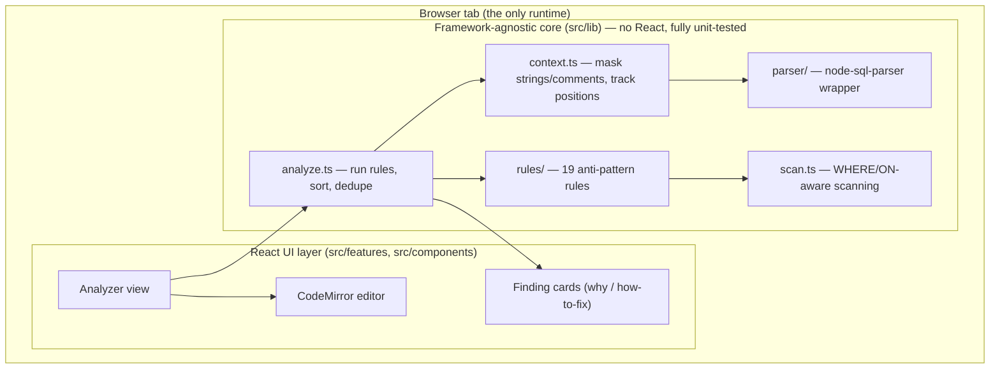

# SQL Query Doctor — Interview Preparation Guide

> A complete, interview-ready companion to the project. Read top-to-bottom once, then skim sections
> before an interview. Everything here reflects what is actually in the codebase — if you can
> explain this document, you can defend the project.

**What the project is, in one line:** a browser-based tool that **checks a SQL query for performance
anti-patterns** across four dialects and, for each issue, tells you *why it's slow* and *how to fix
it* — with **no backend**.

---

## Table of contents

1. [The 30-second and 2-minute pitch](#1-the-30-second-and-2-minute-pitch)
2. [USP, differentiation & extra features (the "informal" stuff)](#2-usp-differentiation--extra-features)
3. [System design & architecture (with diagram)](#3-system-design--architecture)
4. [Tech stack deep dive — what, why, why-not, key concepts, likely Q&A](#4-tech-stack-deep-dive)
   - [TypeScript](#41-typescript)
   - [React 18](#42-react-18)
   - [Vite](#43-vite)
   - [Vitest + Testing Library](#44-vitest--testing-library)
   - [node-sql-parser](#45-node-sql-parser)
   - [CodeMirror 6](#46-codemirror-6)
   - [Supporting libraries (Fontsource, CSS tokens)](#47-supporting-libraries)
5. [The SQL domain — the heart of the project](#5-the-sql-domain)
   - [Sargability & indexes](#51-sargability--indexes-the-single-most-important-concept)
   - [The 19 anti-pattern rules](#52-the-19-anti-pattern-rules-with-examples)
   - [How the detection actually works (masking)](#53-how-the-detection-actually-works)
6. [File-by-file map — what each file does & how they link](#6-file-by-file-map)
7. [Rapid-fire interview Q&A](#7-rapid-fire-interview-qa)
8. [Known limitations & "what I'd do next" (senior signal)](#8-known-limitations--what-id-do-next)

---

## 1. The 30-second and 2-minute pitch

**30-second version:**
> "SQL Query Doctor is a browser-based SQL linter focused on *performance*. You paste a query, pick
> a dialect, and it flags performance anti-patterns — leading-wildcard LIKEs, non-sargable functions,
> N+1 subqueries, accidental cross joins, and so on — and for each one it explains *why* it's slow
> and *how* to fix it. It supports four SQL dialects, runs entirely in the browser with no backend,
> and has 94 tests."

**2-minute version — problem → solution → proof:**
- **Problem:** Developers write slow SQL and don't find out until production. Regular linters check
  *style/syntax*; very few check *performance*, and the knowledge of *why* something is slow lives in
  senior engineers' heads.
- **Solution:** A linter dedicated to performance anti-patterns that doesn't just flag — it *teaches*,
  pairing every finding with the reason it's slow and a concrete fix. Four dialects, instant feedback
  as you type.
- **Proof / the hard part:** Making the detection robust — it works even on SQL that doesn't fully
  parse, and it never false-fires on keywords that appear inside string literals or comments (via a
  length-preserving "masking" pass). That robustness is the real engineering.

---

## 2. USP, differentiation & extra features

### What's the USP (unique selling proposition)?
1. **Performance-focused, and it explains itself.** Most SQL linters check formatting/syntax. This
   one targets *performance* anti-patterns, and every finding ships with *why it's slow* + *how to
   fix it* — it teaches, it doesn't just scold.
2. **Four dialects, one tool.** PostgreSQL, MySQL, SQL Server (T-SQL), and SQLite — normally four
   different ecosystems — are handled in one place.
3. **Robust by design.** It lints SQL that doesn't fully parse, and its scanner is string/comment
   aware so it never trips on keywords inside literals. That resilience is the differentiator vs a
   naive regex linter.

### How is it different from a typical student project?
- It's **not a CRUD app.** No "to-do list + REST API." The complexity is *algorithmic* — a rules
  engine, a string/comment masking pass, exact source-position tracking.
- It's **genuinely tested** (94 tests, a positive *and* a negative case per rule) — false positives
  are as bad as misses in a linter, and the tests enforce both.
- It has a **deliberate design system** (neo-brutalist frame + Solarized palette driven entirely by
  CSS custom properties).

### Extra features worth mentioning
- **Live analysis** as you type (memoized so it only re-runs on change).
- **Severity model** (critical / high / medium / low) with filtering, plus a browsable **rule
  catalog**.
- **Exact source locations** (line:col) for every finding, computed from character offsets.
- **Privacy/offline by design**: no backend — nothing you type leaves the browser.

---

## 3. System design & architecture

### 3.1 The big picture

This is a **client-only Single Page Application (SPA)** — no server, no API. Everything runs in the
browser tab.



### 3.2 The key architectural decision: `lib/` vs `features/`

> **All the real logic lives in `src/lib/`, which has zero React imports. The React layer in
> `src/features/` is a thin "view" over it.**

**Why this matters (say this in an interview):**
- **Testability**: pure functions with no DOM/React can be unit-tested fast and deterministically.
  That's why there are 94 tests — the hard logic is trivially testable.
- **Separation of concerns**: the analyzer doesn't know it's in a browser; `analyzeSql(sql, dialect)`
  could run in Node, a CLI, a CI pre-commit hook, or a VS Code extension unchanged.
- **Replaceable UI**: I could swap React for Svelte and `src/lib` wouldn't change a line.

This is the classic **"functional core, imperative shell"** pattern. The core is pure
(string in → findings out); the shell (React) just renders.

### 3.3 Data-flow

```
SQL text ─▶ buildContext(sql, dialect)
                 │   produces { raw, masked, codeMask, lower, ast?, parseError? }
                 ▼
          for each of 19 rules: rule.detect(ctx) → Detection[]  (index, length, message…)
                 │
          analyze.ts: resolve each Detection's line/col, merge rule metadata
                      (title, severity, explanation, fix), sort by position, dedupe
                 ▼
          AnalysisResult { findings[], counts, parseError } ─▶ React finding cards
```

The whole pipeline is **synchronous and pure**, which is why it can run live on every keystroke
(wrapped in `useMemo` so it only recomputes when the SQL or dialect changes).

### 3.4 System-design questions you might get

**Q: Why client-side only? Trade-offs?**
- **Pros:** zero infra cost, privacy (nothing leaves the browser), works offline, trivial deployment
  (static files on any CDN), scales for free (compute is the user's).
- **Cons:** logic ships to the client (fine — it's not secret), and heavy parsing happens on the
  user's machine (negligible for single queries). For a linter, client-side is strictly better.

**Q: How do you keep it fast / responsive while linting on every keystroke?**
- The analysis is pure and cheap, and it's wrapped in `useMemo(() => analyzeSql(sql, dialect),
  [sql, dialect])` so it only recomputes when inputs change, not on every render. If it ever got
  heavy I'd debounce input or move analysis to a Web Worker.

**Q: How do you keep the bundle reasonable?**
- `manualChunks` splits the big vendors (`node-sql-parser`, CodeMirror, React) so they cache
  independently; assets are content-hashed for long-lived CDN caching; tree-shaking drops unused
  exports.

**Q: Security?**
- No backend → no server to attack, no secrets. User SQL is rendered as **text**, never HTML, so
  there's no XSS surface.

**Q: State management?**
- React local state (`useState`) + `useMemo`. No Redux/Zustand — there's no cross-cutting global
  state worth the complexity. **Knowing when *not* to add a state library is a senior signal.**

---

## 4. Tech stack deep dive

For each technology: **what it is → why I chose it → why not the alternative → key concepts
("branches") → likely questions.**

### 4.1 TypeScript

**What it is:** A superset of JavaScript that adds *static types*, checked at compile time and erased
at runtime (it compiles to plain JS). It catches type errors before the code runs.

**Why I chose it:** The core is a rules engine with shared contracts — `Rule`, `Finding`,
`Detection`, `SqlContext`. Types make those contracts explicit and caught many mistakes (e.g. a rule
returning the wrong shape) at compile time.

**Why not plain JavaScript:** No compile-time safety; refactors become dangerous; the contracts would
only live in my head.

**Key concepts / branches to know:**
- **Types vs interfaces** — `interface` for object shapes (`Rule`, `Finding`), `type` for unions
  (`type Dialect = "postgresql" | "mysql" | "transactsql" | "sqlite"`, `type Severity`).
- **Union & literal types** — `Severity`, `Category`, `Dialect` are string-literal unions; they make
  illegal states unrepresentable.
- **Generics** — e.g. helper functions and typed records (`Record<Severity, number>` for counts).
- **`strict` mode** — `tsconfig` has `strict`, `noUnusedLocals`, `noUnusedParameters`,
  `noFallthroughCasesInSwitch`.
- **`satisfies` operator** — used in `analyze.ts` to type-check a value without widening it.
- **Type erasure** — types vanish at runtime; you can't `instanceof` an interface.
- **`unknown` vs `any`** — the parser wrapper takes `unknown` AST and narrows it safely.

**Likely questions:**
- *`interface` vs `type`?* Interfaces are open/mergeable, great for objects; `type` also does unions,
  tuples, mapped/conditional types.
- *`strictNullChecks`?* `null`/`undefined` aren't assignable unless declared — forces explicit
  handling.
- *Does TS make code faster at runtime?* No — it's erased; it improves developer speed/correctness.
- *`any` vs `unknown`?* `any` disables checking; `unknown` must be narrowed before use.

### 4.2 React 18

**What it is:** A declarative UI library. UI is a function of state (`UI = f(state)`); React diffs a
virtual DOM and updates only what changed.

**Why I chose it:** The UI is interactive and state-driven (live linting as you type, expandable
cards, dialect switching, severity filters). React's hooks fit that, and the CodeMirror React wrapper
is mature.

**Why not vanilla JS/jQuery:** Manual DOM updates for live-updating findings would be error-prone.
**Why not Angular:** heavier, overkill. **Why not Svelte/Vue:** fine, but React has the deepest
ecosystem and is the most common interview expectation; the core `lib/` is framework-agnostic anyway.

**Key concepts / branches (hooks I actually use):**
- **`useState`** — local state (current SQL, dialect, severity filter, which cards are expanded).
- **`useMemo`** — memoizes derived data: `const result = useMemo(() => analyzeSql(sql, dialect),
  [sql, dialect])` re-lints only when the input changes.
- **Controlled components** — the editor and selects are controlled (value + onChange).
- **Lists & `key`** — findings are rendered from an array with stable keys.
- **Conditional rendering** — empty state vs findings list vs "all clear."
- **`StrictMode`** — dev-only double-invocation to surface impure effects.
- **Component composition** — reusable primitives (`Button`, `Badge`, `Card`) compose the views.

**Likely questions:**
- *Virtual DOM / reconciliation?* An in-memory tree React diffs to compute minimal real-DOM updates.
- *Why `key`s?* Stable identity across renders; avoid array indices for reorderable lists.
- *`useMemo` vs `useCallback`?* Memoize a *value* vs a *function*.
- *When does a component re-render?* When its state/props change, or its parent re-renders.
- *Why memoize the analysis?* So typing (which re-renders) doesn't redundantly re-lint when the SQL
  hasn't changed.

### 4.3 Vite

**What it is:** A modern build tool + dev server. Dev serves source over native ES modules with
instant HMR; production bundles with Rollup.

**Why I chose it:** Near-instant dev startup/HMR, first-class TS/React support, and simple config for
vendor chunk splitting.

**Why not Create React App:** deprecated, slow (Webpack). **Why not raw Webpack:** far more config.
**Why not Parcel:** fine, but Vite is the current standard.

**Key concepts / branches:**
- **Dev vs build**: dev uses **esbuild** (Go, very fast) + native ESM; build uses **Rollup**
  (tree-shaken, code-split, minified).
- **HMR (Hot Module Replacement)**: swaps changed modules without a full reload.
- **`manualChunks`**: splits `vendor-react`, `vendor-editor`, `vendor-sqlparser` so app-code changes
  don't bust big vendor caches.
- **Content hashing**: output filenames include a hash → safe long-term caching.
- **Tree-shaking**: unused exports dropped.
- **Path alias**: `@` → `src` configured in both Vite and Vitest.

**Likely questions:**
- *Why is Vite's dev server fast?* Native ESM (no bundling in dev) + esbuild transforms.
- *Dev vs prod difference?* Dev = unbundled ESM; prod = Rollup bundle, minified, split, hashed.
- *What is code-splitting and why?* Load chunks on demand / cache vendors separately → smaller,
  cacheable downloads.

### 4.4 Vitest + Testing Library

**What it is:** Vitest is a Vite-native test runner (Jest-compatible API). Testing Library renders
components and queries them as a user would. **jsdom** provides a fake DOM in Node.

**Why I chose it:** It reuses my Vite config (same aliases/transforms) so tests "just work," and it's
fast. The API mirrors Jest, so the knowledge transfers.

**Why not Jest:** needs separate Babel/TS config, slower start, doesn't share Vite's resolution.

**Key concepts / branches:**
- **Unit tests**: the bulk — pure functions in `src/lib` (masking, positions, each rule, the runner,
  the parser wrapper).
- **Positive & negative cases**: every lint rule has a test that it *fires* on bad SQL and *doesn't*
  fire on good SQL. This is the most important testing idea in the project — a linter that
  false-fires is worse than useless.
- **Edge-case tests**: e.g. a keyword inside a string/comment must *not* trigger; CRLF is normalized;
  invalid SQL still lints.
- **Arrange–Act–Assert** structure.
- **Coverage**: `npm run coverage` (v8 provider) over `src/lib`.
- **`globals: true` + `setupFiles`**: `describe/it/expect` are global; `setup.ts` wires
  `@testing-library/jest-dom` matchers.

**Likely questions:**
- *Why both a positive and a negative test per rule?* To catch misses *and* false positives — a
  linter must do both.
- *What is jsdom?* A JavaScript implementation of the DOM so component tests run in Node without a
  real browser.
- *Unit vs integration test?* Unit = one function in isolation; integration = multiple units
  together. This project is almost entirely unit-tested because the core is pure.

### 4.5 node-sql-parser

**What it is:** A JavaScript SQL parser that turns SQL text into an **AST (Abstract Syntax Tree)** and
supports multiple dialects (PostgreSQL, MySQL, T-SQL/`transactsql`, SQLite, etc.).

**Why I chose it:** The most mature multi-dialect SQL parser in JS, and its dialect support maps
directly onto my "4 dialects" requirement.

**Why not write my own parser:** SQL grammar is huge; hand-rolling one would be months and still
incomplete. **Why not regex alone:** regex can't understand nested structure reliably.

**Key concepts / branches:**
- **AST (Abstract Syntax Tree)** — a tree representation of code structure (SELECT with columns,
  FROM, WHERE sub-trees). A classic interview topic; know what it is and that compilers, linters, and
  formatters all use ASTs.
- **Lexer/parser basics** — tokenize text, then build a tree per a grammar.
- **Hybrid approach (important nuance)** — I *don't* rely solely on the AST. Parsers fail on edge
  cases and dialect quirks, so my linter is **text-driven with the AST as a bonus**: it still lints
  SQL that doesn't fully parse. `parser/parse.ts` captures the error instead of throwing, and
  `analyzeSql` reports it as a warning while still returning findings.

**Likely questions:**
- *What's an AST?* A structured tree of parsed code; used by compilers/linters/formatters.
- *Why not use the AST for every rule?* Parsers break on real-world SQL; a text-first scanner with
  string/comment masking is more robust for a linter. (A great "I made a trade-off" answer.)
- *How do you support four dialects?* `node-sql-parser` takes a `database` option; I pass the user's
  selected dialect, and the editor highlights with the matching CodeMirror SQL dialect.

### 4.6 CodeMirror 6

**What it is:** A modern, extensible code-editor component (syntax highlighting, selection, line
numbers). I use `@uiw/react-codemirror` (React wrapper) + `@codemirror/lang-sql`.

**Why I chose it:** Lighter and more modular than Monaco (the VS Code editor), with first-class SQL
language support that's *dialect-aware*, and easy to theme to the design system.

**Why not Monaco:** huge (basically VS Code) — overkill for a single SQL input. **Why not a plain
`<textarea>`:** no syntax highlighting or SQL awareness.

**Key concepts / branches:**
- **Extensions architecture**: CM6 is composed of extensions (language, theme, line numbers). I pass
  `sql({ dialect })`, a custom theme, and `EditorView.lineWrapping`.
- **Dialect mapping**: my `Dialect` union maps to CodeMirror's SQL dialects
  (`PostgreSQL/MySQL/MSSQL/SQLite`) in `editorTheme.ts`.
- **Theming**: `EditorView.theme()` for the chrome + a `HighlightStyle` mapping Lezer syntax *tags*
  (keyword/string/number/comment) to Solarized colors.
- **Lezer**: CodeMirror's incremental parser; `@lezer/highlight` provides the tags I style.
- **Controlled component**: value + `onChange` wired to React state so edits re-trigger linting.

**Likely questions:**
- *Why CodeMirror over Monaco?* Smaller, modular, enough features; Monaco is overkill.
- *How does syntax highlighting work?* The language parser (Lezer) tags tokens; a highlight style
  maps tags to colors.

### 4.7 Supporting libraries

- **Fontsource** (`@fontsource/*`) — self-hosts the fonts (Anton, Space Grotesk, JetBrains Mono) as
  npm packages so the app works **offline** and doesn't depend on Google Fonts' CDN (privacy +
  reliability).
- **CSS custom properties (design tokens)** — the entire theme is variables in
  `src/styles/tokens.css`. Switching from the original hot-pink "Yestalgia" look to **Solarized** was
  mostly editing *one file*. A design-system / maintainability decision, not just styling.

---

## 5. The SQL domain

This is the core knowledge the whole project is built on. If the interviewer is technical, this is
where you win or lose.

### 5.1 Sargability & indexes (the single most important concept)

**Index (B-tree):** Most databases index columns with a **B-tree** — a balanced, sorted tree giving
O(log n) lookups and efficient *range* scans. The index stores column values in sorted order plus
pointers to the rows.

**Sargable** = "**S**earch **ARG**ument **able**" = a `WHERE` condition the database can satisfy by
seeking/ranging an index instead of scanning every row. **Non-sargable** conditions force a
**full/sequential scan** (read every row), which is O(n).

The analyzer is, at heart, a **sargability checker**. The golden rule it enforces:

> **Keep the indexed column "bare" on one side of the comparison.** The moment you wrap it in a
> function, add a leading wildcard, or change its type, the B-tree (sorted by the *raw* value) can't
> be used.

Examples (bad → good):
| Non-sargable (full scan) | Sargable (index usable) |
| --- | --- |
| `WHERE YEAR(created_at) = 2024` | `WHERE created_at >= '2024-01-01' AND created_at < '2025-01-01'` |
| `WHERE name LIKE '%smith'` | `WHERE name LIKE 'smith%'` (or a trigram index for contains) |
| `WHERE user_id = '42'` (string vs int) | `WHERE user_id = 42` |
| `WHERE UPPER(email) = 'A@B.COM'` | store/compare lowercase, or a functional index |

**Index types to know (interviewers love these):**
- **B-tree** — default; equality + range + sorting + prefix.
- **Composite (multi-column)** — e.g. `(user_id, status)`; follows the **leftmost-prefix rule** (can
  use it for `user_id` alone or `user_id + status`, but not `status` alone).
- **Covering / index-only scan** — if the index contains *all* columns the query needs, the DB never
  touches the table. (This is why `SELECT *` is flagged — it defeats covering indexes.)
- **Unique index** — enforces uniqueness + speeds equality lookups.
- **GIN / trigram (pg_trgm)** — the real fix for leading-wildcard / `%contains%` search.

**`EXPLAIN` (good background knowledge):** every database has `EXPLAIN` (and `EXPLAIN ANALYZE`) to show
the *execution plan* — the tree of scans/joins/sorts the planner chose. A **sequential scan** on a
big table where an **index scan** was possible is the visible symptom of the non-sargable predicates
this tool catches *before* you ever run the query.

### 5.2 The 19 anti-pattern rules (with examples)

Grouped by category (`src/lib/analyzer/rules/`). Each rule carries a severity, an explanation, and a
fix.

**Index usage (`indexUsage.ts`)**
1. **leading-wildcard-like** (high) — `LIKE '%foo'` can't use a B-tree (sorted by prefix). Fix:
   anchor (`'foo%'`) or a trigram/full-text index.
2. **non-sargable-function** (high) — `UPPER(col) = …`, `DATE(col) = …` wrap the column. Fix: bare
   column + range, or a functional index.
3. **implicit-conversion** (medium) — `user_id = '42'` compares int to string → implicit cast may
   disable the index. Fix: match the literal's type.
4. **or-in-where** (medium) — `OR` across columns often prevents a single index range. Fix: `IN`,
   `UNION ALL`, or a composite/partial index.
5. **inequality-operator** (low) — `!=` / `<>` is non-sargable (matches almost everything).
6. **like-no-wildcard** (low) — `LIKE 'x'` with no wildcard is just `=`; use `=`.
7. **having-without-aggregate** (low) — filtering a plain column in `HAVING` runs *after* grouping;
   move it to `WHERE` so it filters first (and can use an index).

**Joins / subqueries (`joins.ts`)**
8. **not-in-subquery** (high) — `NOT IN (SELECT …)` is slow *and* returns zero rows if the subquery
   yields a `NULL` (3-valued-logic trap). Fix: `NOT EXISTS` / anti-join.
9. **in-subquery** (medium) — `IN (SELECT …)` can materialize the inner result; prefer `EXISTS`/JOIN.
10. **scalar-subquery-in-select** (medium) — a subquery per output column is the SQL equivalent of
    **N+1** (runs once per row). Fix: fold into a JOIN.
11. **implicit-cross-join** (high) — `FROM a, b` without a join condition = Cartesian product. Fix:
    explicit `JOIN … ON`.

**Projection (`projection.ts`)**
12. **select-star** (medium) — `SELECT *` inflates I/O and defeats covering indexes. Fix: list columns.
13. **select-distinct** (low) — `DISTINCT` often masks a join that fans out rows; it forces a
    sort/hash to dedupe.

**Sorting (`sorting.ts`)**
14. **order-by-random** (high) — `ORDER BY random()` sorts the *whole* table to pick a few rows. Fix:
    `TABLESAMPLE` or key-based random selection.
15. **limit-without-order-by** (low) — `LIMIT` with no `ORDER BY` returns a non-deterministic subset.

**Pagination (`pagination.ts`)**
16. **large-offset-pagination** (medium) — `OFFSET 100000` still reads and discards 100K rows every
    call → deep pages get linearly slower. Fix: **keyset/seek pagination**
    (`WHERE id > :lastId ORDER BY id LIMIT n`).

**Set operations (`setOps.ts`)**
17. **union-instead-of-union-all** (medium) — `UNION` deduplicates (sort/hash); use `UNION ALL` when
    duplicates can't occur.

**Correctness (`correctness.ts`)**
18. **missing-where-dml** (critical) — `UPDATE`/`DELETE` with no `WHERE` hits every row.
19. **equals-null** (medium) — `= NULL` is always UNKNOWN (3-valued logic); use `IS NULL`.

### 5.3 How the detection actually works

This is the part that shows real engineering — be ready to explain it.

1. **Masking (`context.ts` → `maskSql`)**: before scanning, the SQL is copied into a **masked**
   version where the *contents* of string literals (`'...'`), quoted identifiers (`"..."`,
   backticks), and comments (`-- …`, `/* … */`, `#` for MySQL) are replaced with spaces — **but
   newlines and total length are preserved**. A parallel boolean `codeMask[]` marks which characters
   are "real code."
   - **Why:** so a rule scanning for the keyword `DELETE` never fires on `WHERE note = 'DELETE me'`.
     The keyword is inside a string, which is blanked in the masked copy.
   - **Why length-preserving:** every match index in the masked string maps 1:1 to the same index in
     the raw string, so reported line/column positions are exact. When a rule needs the *literal's
     contents* (e.g. to check if a `LIKE` pattern starts with `%`), it reads from the **raw** string
     at that index.

2. **Scanning (`scan.ts`)**: helpers run regexes over the masked text and expose where the `WHERE` /
   `ON` clauses are, so rules can restrict themselves to the relevant part of the query.

3. **Rules (`rules/*.ts`)**: each rule's `detect(ctx)` returns `Detection[]` — `{ index, length,
   message, … }` pointing into the raw SQL.

4. **Runner (`analyze.ts`)**: converts each `Detection` to a line/column (via `positionAt`), merges in
   the rule's metadata (title, severity, category, explanation, fix), sorts by position, and
   de-duplicates. Output: `AnalysisResult { findings[], counts, parseError }`.

**The bug I hit and fixed (great story):** my `LIKE` rules originally matched on the masked text and
then tried to read the string literal — but masking had *blanked* the literal, so leading-wildcard
`LIKE` never fired. Fix: locate the `LIKE` keyword on the masked text (so comments are ignored), then
read the following literal from the **raw** text. It's the perfect illustration of *why* the
masked/raw split exists.

---

## 6. File-by-file map

### Config & root
| File | Purpose |
| --- | --- |
| `package.json` | Dependencies + scripts (`dev`, `build`, `test`, `typecheck`, `coverage`). |
| `vite.config.ts` | Build config: React plugin, `@` path alias, **manualChunks** vendor splitting. |
| `vitest.config.ts` | Test config: jsdom env, globals, setup file, coverage of `src/lib`. |
| `tsconfig*.json` | TypeScript config (app vs node) in strict mode. |
| `index.html` | SPA entry; loads `src/main.tsx`. |
| `README.md` / `CLAUDE.md` | Project overview / contributor guide. |

### Entry, shell & styles
| File | Purpose |
| --- | --- |
| `src/main.tsx` | React root; imports fonts + all CSS; renders `<App>`. |
| `src/App.tsx` | App shell: header, the Analyzer view, footer, decorations. |
| `src/styles/tokens.css` | **All color/spacing/typography tokens** (Solarized) as CSS variables. |
| `src/styles/{global,components,app,features}.css` | Base, primitives, layout, finding cards. |
| `src/components/ui/primitives.tsx` | Reusable `Button`, `Badge`, `Card`, `Select`, `Segmented`. |
| `src/components/Decor.tsx` | Decorative SVG Memphis shapes (bolt, star, blob). |

### Core logic — `src/lib/` (no React; this is where the tests are)
| File | Purpose |
| --- | --- |
| `analyzer/types.ts` | `Dialect`, `Severity`, `Category`, `Finding`, `Rule`, `SqlContext` contracts. |
| `analyzer/context.ts` | `buildContext()` + **`maskSql()`** (blank strings/comments) + position math. |
| `analyzer/scan.ts` | Scanning helpers: regex over masked text, WHERE/ON clause detection. |
| `analyzer/rules/*.ts` | The 19 rules, grouped by category. |
| `analyzer/rules/index.ts` | `ALL_RULES` registry + `RULES_BY_ID`. |
| `analyzer/analyze.ts` | `analyzeSql()` — runs rules, resolves positions, sorts, dedupes, counts. |
| `parser/parse.ts` | Wraps `node-sql-parser`; returns AST **or a captured error** (never throws). |

### Feature view — `src/features/analyzer/`
| File | Purpose |
| --- | --- |
| `AnalyzerView.tsx` | Editor + dialect picker + live findings + severity filters + rule catalog. |
| `SqlEditor.tsx` | CodeMirror wrapper (dialect-aware, themed). |
| `editorTheme.ts` | Solarized CodeMirror theme + dialect mapping. |
| `FindingCard.tsx` | Expandable finding (why / how-to-fix). |
| `examples.ts` | Demo SQL snippets for the "Load example" menu. |

### How they link (one sentence)
`main.tsx` → `App.tsx` renders `AnalyzerView`, which calls `analyzeSql()` in `src/lib/analyzer` (which
uses `context` → `parser` + `scan` + `rules`) and renders the returned findings as cards.

---

## 7. Rapid-fire interview Q&A

**"Walk me through the project."** → Use the 2-minute pitch (§1), then offer to deep-dive the masking
mechanism or a specific rule.

**"What was the hardest part?"** → Making detection robust: the string/comment **masking** pass (scan
structure on a masked copy, read literals from the raw text) so keywords inside strings/comments never
false-fire, while keeping source positions exact.

**"What's a bug you hit?"** → The `LIKE` rules scanned masked text but needed the literal, which
masking had blanked — leading-wildcard `LIKE` never fired. Fixed by locating the keyword on masked
text and reading the literal from raw text. (§5.3)

**"Why client-side / no backend?"** → It's a linter — pure input→output. Client-side gives privacy,
offline use, zero infra, and trivial deployment.

**"How would you add a new rule?"** → Implement a `Rule` with `detect(ctx)` returning `Detection[]`,
register it in `rules/index.ts`, add a positive + negative test. The architecture is built for this.

**"How do you avoid false positives?"** → The masking pass (no matches inside strings/comments),
scoping rules to the right clause, and a required negative test per rule.

**"Is it hard / did you really build it?"** → The value is algorithmic: a rules engine, a
length-preserving masking pass, exact position tracking, and multi-dialect parsing. Mature libraries
(node-sql-parser, CodeMirror) handle parsing/editing; the detection logic is mine and fully tested.

**Core SQL one-liners** (be ready):
- *Index lookup complexity?* O(log n) for a B-tree. *Full scan?* O(n).
- *Why is `LIKE '%x'` slow but `'x%'` fast?* B-trees sort by prefix; a leading wildcard has no prefix
  to seek.
- *Cartesian product size?* rows(a) × rows(b).
- *3-valued logic?* SQL booleans are TRUE/FALSE/**UNKNOWN**; comparisons with `NULL` yield UNKNOWN.
- *What does `EXPLAIN` show?* The planner's execution plan (scans/joins/sorts) with cost estimates.

---

## 8. Known limitations & "what I'd do next"

Mentioning these *unprompted* is a strong senior signal — it shows judgment, not insecurity.

- **The linter is heuristic, not a full semantic analyzer.** It uses text scanning + a best-effort
  AST, so it can have occasional false positives/negatives — e.g. it doesn't know which columns are
  *actually* indexed, so it flags patterns that *could* be slow, not ones it's proven are. A deeper
  version would read the real schema. *Trade-off: robustness/generality over precision.*
- **Rules are pattern-based**, so unusual-but-equivalent SQL phrasings can slip through. Moving more
  rules onto the AST (where it parses) would tighten precision.
- **No auto-fix yet** — findings explain the fix in prose but don't rewrite the query. An auto-fix
  (e.g. turn `NOT IN (subquery)` into `NOT EXISTS`) is the natural next feature.
- **Next features I'd build:** schema-aware suggestions (read `CREATE TABLE` to know real indexes),
  one-click auto-fix, shareable permalinks, and a VS Code extension (the core `lib/` already has no
  browser dependency, so it would drop in).

---

*This document mirrors the codebase as built. If an interviewer opens the repo, every claim here is
backed by a file you can point to.*
